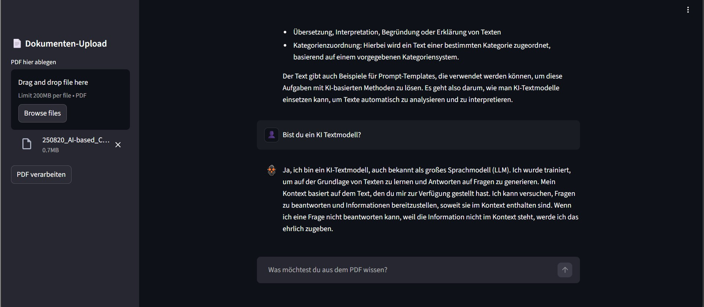

#  PDF'i - Intelligent PDF Assistant

Ein smartes RAG-System (Retrieval-Augmented Generation), entwickelt als Proof-of-Concept für die interaktive Analyse von Dokumenten. 

Dieses Projekt vereint modernes UI/UX-Design mit leistungsstarker KI-Technologie und entstand im Rahmen meiner Spezialisierung zum Fachinformatiker für Anwendungsentwicklung (FIAE). Der Fokus liegt auf einer nahtlosen User Experience, sauberem Branding und einer hochperformanten Backend-Architektur.

<div align="center">
  
</div>

## 🛠️ Tech-Stack

* **Frontend:** Streamlit (mit Custom SVG-Branding und Base64-Injektion)
* **LLM:** Llama 4 Scout (via Groq API für maximale Inferenz-Geschwindigkeit)
* **Embeddings:** HuggingFace `all-MiniLM-L6-v2` (Lokal ausgeführt)
* **Vektor-Datenbank:** FAISS (In-Memory für schnelle und sichere Abfragen)
* **Framework:** LangChain & LangChain-Groq

## ✨ Kern-Features

* 📄 **Smarte PDF-Verarbeitung:** Automatisches Text-Splitting und lokale Vektorisierung.
* ⚡ **High-Speed Inference:** Blitzschnelle Antworten auf komplexe Dokumentenfragen durch die Anbindung an die Groq API.
* 🎨 **Custom UI/UX:** Sauberes, responsives Interface. Das Maskottchen "PDF'i" wurde als skalierbare Vektorgrafik (SVG) eigens für dieses Projekt entworfen und nahtlos integriert.
* 🔒 **Sicherheit & Architektur:** Die Dokumentenverarbeitung (Embeddings) und die FAISS-Vektordatenbank laufen im Arbeitsspeicher, API-Keys werden sicher über Umgebungsvariablen (Secrets) verwaltet.

## 🚀 Lokale Installation & Start

1. **Repository klonen:**
   ```bash
   git clone [https://github.com/DEIN_USERNAME/PDFi.git](https://github.com/DEIN_USERNAME/PDFi.git)
   cd PDFi
Abhängigkeiten installieren:

Bash
pip install -r requirements.txt
Umgebungsvariablen setzen:
Erstelle eine .env Datei im Hauptverzeichnis und füge deinen Groq API Key ein:

Plaintext
GROQ_API_KEY=dein_groq_api_key_hier
App starten:

Bash
streamlit run src/app.py
📖 Roadmap & Status
[x] Projekt-Setup & Architekturplanung

[x] Implementierung der RAG-Logik (rag_core.py)

[x] UI-Entwicklung & Custom Branding (app.py)

[x] Deployment auf Hugging Face Spaces

[ ] Erweiterung um Multi-Dokumenten-Unterstützung (Future Feature)

Design meets Code. Entwickelt mit Fokus auf Funktionalität und User Experience.